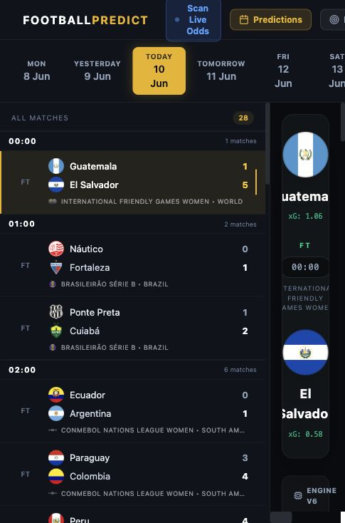
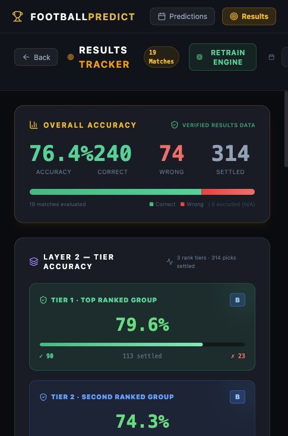

# Football Predictor AI

Football Predictor AI is a local full-stack football analysis application for match screening, probability modeling, tiered prediction review, and post-match accuracy tracking.

The app combines a FastAPI backend, a React/Vite frontend, Poisson and model-based probability engines, calibration logic, result verification, and a risk-aware tiering layer. It is designed to help review football markets more professionally by separating full analysis from a stricter ranked shortlist.

> Important: this project is an analytical decision-support tool. It does not guarantee betting profit, winning streaks, or future outcomes. Use bankroll controls and independent judgment.

## Screenshots

### Predictions Dashboard



### Results Tracker



## Current Product Surface

The application is organized around two main workflows.

### Predictions

The Predictions view lists daily fixtures and opens a detailed analysis panel for each match.

Key behavior:

- Pulls daily fixtures from available providers.
- Computes match probabilities using Poisson, XGBoost-style predictors, calibration, and data-quality checks.
- Shows full structured market analysis across all sections.
- Promotes a focused confidence layer using the aligned market categories:
  - Result
  - Total Goals
  - Team Goals
  - Handicaps
- Splits all confident picks above 60 percent into three rank-based tiers:
  - Tier 1: top ranked group
  - Tier 2: second ranked group
  - Tier 3: third ranked group
- Shows bankroll gate status separately from displayed confidence.
- Compresses handicap probabilities into a more realistic tradable range and exposes model fair odds.

### Results

The Results Tracker verifies finished matches against the same tier and category structure used in predictions.

It reports:

- Overall settled accuracy.
- Correct, wrong, and excluded pick counts.
- Tier 1, Tier 2, and Tier 3 accuracy.
- Aligned category accuracy for Result, Total Goals, Team Goals, and Handicaps.
- Match-by-match expanded verification.

## Backend Highlights

The backend lives mainly under `api/`, `src/engine/`, `src/db/`, and `src/ml/`.

Important modules:

- `api/main.py`: FastAPI app, fixture endpoints, analysis endpoint, result verification, calibration/debug routes.
- `src/engine/probability_engine.py`: core probability generation.
- `src/engine/performance_gate.py`: runtime quality gate for promoted picks.
- `src/engine/execution_engine.py`: stricter execution-style filters and bankroll-preservation rules.
- `src/engine/qualification_engine.py`: layered qualification checks.
- `src/db/prediction_logger.py`: prediction logging and calibration data.
- `src/db/error_intelligence.py`: learned league confidence adjustment.
- `src/ml/`: model helpers and feature builders.

## Frontend Highlights

The frontend is a Vite React app in `frontend/`.

Important components:

- `frontend/src/App.jsx`: top-level routing and fixture loading.
- `frontend/src/components/MatchDetail.jsx`: prediction detail view, full analysis, rank tiers.
- `frontend/src/components/ResultsTracker.jsx`: results verification and accuracy dashboard.
- `frontend/src/components/MatchRow.jsx`: fixture list row.
- `frontend/src/components/DatePicker.jsx`: date navigation.

## Local Setup

### Prerequisites

- Python 3.11 or newer
- Node.js 20 or newer
- npm
- GitHub CLI, if you want to publish with `gh`

### Python Dependencies

```bash
python3 -m venv .venv
source .venv/bin/activate
pip install -r requirements.txt
```

Some provider paths may also require optional packages used by the local runtime. If a missing package error appears, install the named package in the active environment.

### Frontend Dependencies

```bash
cd frontend
npm install
cd ..
```

### Environment

Create local environment files from your own credentials. Do not commit real keys.

Common variables:

```bash
APIFOOTBALL_API_KEY=your_api_football_key
VITE_API_URL=/api
```

The repository ignores `.env` files and SQLite database files by default.

## Run Locally

The project includes a convenience launcher:

```bash
OPEN_BROWSER=0 API_PORT=8011 WEB_PORT=5176 ./run_web.command
```

Then open:

```text
http://127.0.0.1:5176/
```

Default local services:

- Frontend: `http://127.0.0.1:5176`
- API: `http://127.0.0.1:8011`

## Useful API Endpoints

```text
GET  /api/fixtures/{date}
GET  /api/analysis/match/{fixture_id}
GET  /api/results/{date}
GET  /api/debug/model-health
GET  /api/debug/calibration
POST /api/admin/retrain-engine
```

## Validation

The current focused validation commands are:

```bash
python3 -m py_compile api/main.py src/engine/performance_gate.py
PYTEST_ADDOPTS='-o cache_dir=.pytest_cache' python3 -m pytest tests/test_prediction_quality_controls.py -q
cd frontend && npm run build
```

Expected focused test result:

```text
6 passed
```

## Accuracy and Risk Notes

The app now intentionally separates displayed confidence from bankroll qualification.

- A market can appear in Tier 1, Tier 2, or Tier 3 because it is ranked among the best picks above 60 percent.
- A market still needs to pass runtime performance gates before it is considered bankroll-qualified.
- Low data quality, weak market-family history, poor league reliability, and noisy markets can block bankroll qualification.
- Handicap markets are adjusted to avoid unrealistic near-certain display percentages.

This design favors fewer serious actionable picks over inflated confidence.

## Repository Privacy

This project should be published as a private GitHub repository unless you intentionally decide otherwise. Local `.env`, database, cache, and build artifacts should remain untracked.

## Roadmap

Potential next steps:

- Add authenticated provider setup checks.
- Add a dedicated "data provider health" panel in the frontend.
- Add persistent screenshots or reports for daily model performance.
- Add richer calibration charts per market family.
- Add bankroll simulation using only gate-passed picks.
